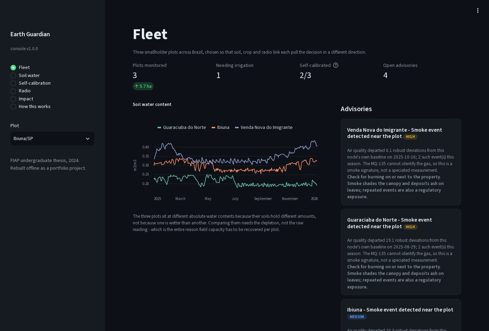
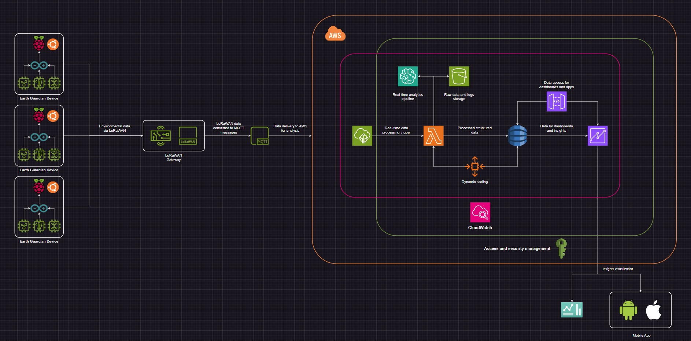
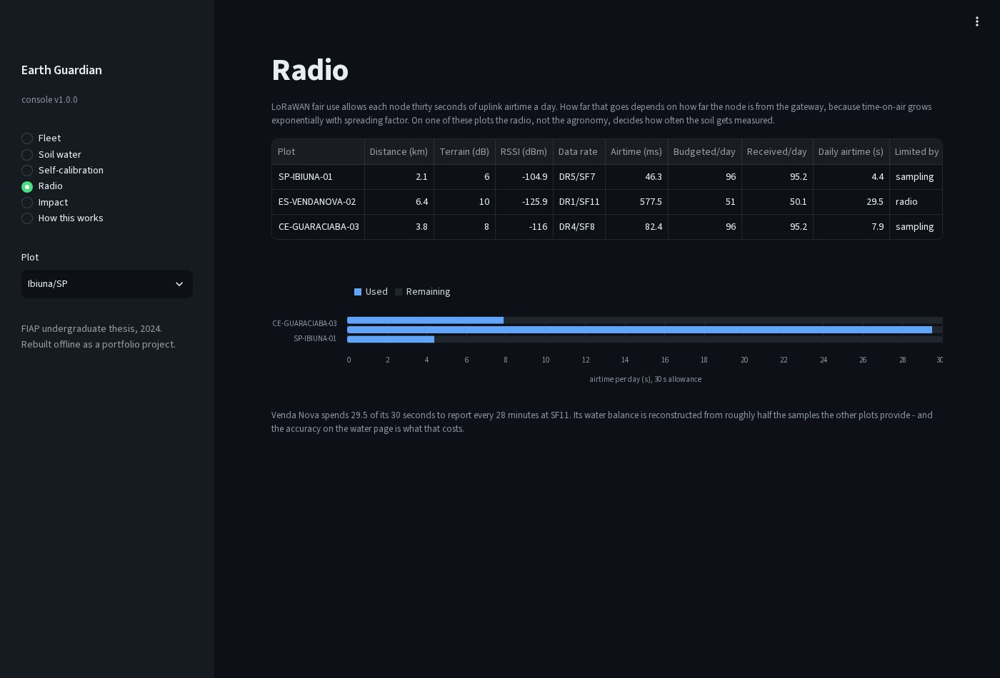
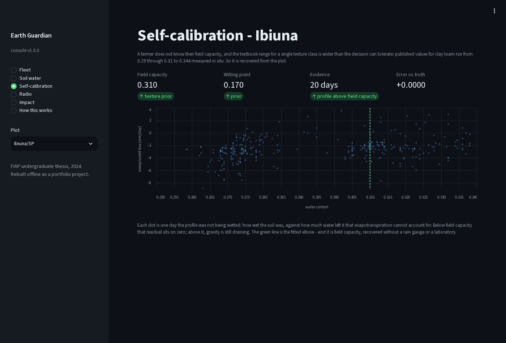
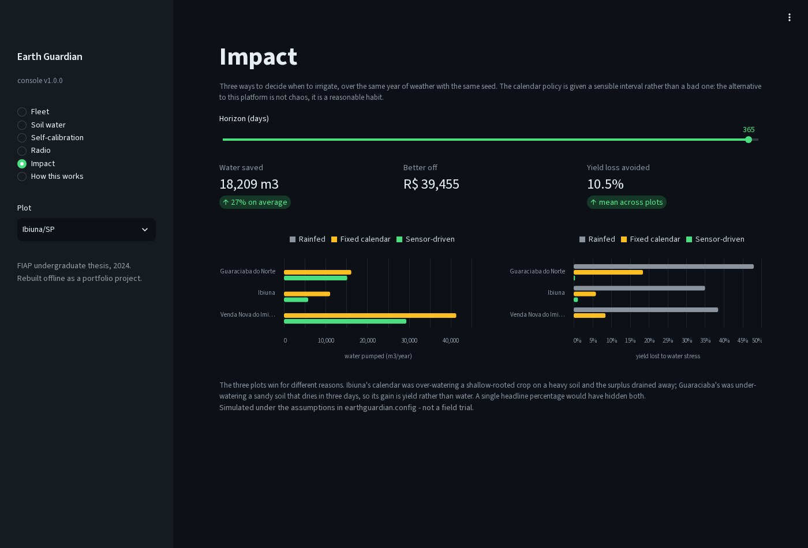

# Earth Guardian System

**Environmental monitoring and irrigation intelligence for smallholder farms — LoRaWAN telemetry, a FAO-56 water balance and a deterministic advisor, running entirely offline.**


Earth Guardian watches five environmental channels on a smallholder plot, reconstructs how much
water the root zone is missing, and turns that into a depth, a date and a price. It simulates the
crop, the weather, the soil physics, the sensors and the radio link, so the whole system runs from a
`git clone` with no hardware, no cloud account and no network access.



> **Origin.** This is an offline reconstruction of the author's 2024 undergraduate thesis at FIAP.
> The project was built and demonstrated on campus using the university's own IoT hardware, and
> none of the code left with it. What survived is the 43-page system document and the architecture
> and circuit diagrams, all preserved in [`docs/original-2024/`](docs/original-2024/). This
> repository implements that **specification** from scratch.

---

## Quick start

```bash
nix develop            # or: pip install -e '.[dev]'
make demo              # simulate a season, ingest it, run GAIA, price the decision
make dashboard         # the console on http://localhost:8501
```

```
earthguardian info       the fleet, the radio budget, what is in the store
             simulate    generate a season, land it in the raw zone, curate it
             analyze     GAIA: recover the soil state, score it, raise advisories
             plan        the irrigation decision, per plot
             impact      rainfed vs fixed calendar vs sensor-driven
             dashboard   the console
```

---

## What the thesis specified

A five-sensor node — soil moisture, air temperature and humidity, illuminance, soil pH and air
quality — on an Arduino Uno, aggregated by a Raspberry Pi, reaching AWS over LoRaWAN and MQTT.
Raw readings into a document store, filtered and enriched records into a relational one. An
advisor called **GAIA** (*Gestão de Análise e Insights Ambientais*) producing predictive insight,
surfaced through a dashboard and a mobile app.



Everything above is implemented here. What is *not* implemented is AWS itself: the pipeline has the
shape of IoT Core, Lambda, S3 and a relational tier, built against the filesystem.

## The plots

Three real Brazilian locations, chosen so that soil, crop and radio each pull the decision a
different way. Every assumption is in [`earthguardian/config.py`](earthguardian/config.py).

| Plot | Crop / soil | Available water | Gateway | The interesting part |
|---|---|---|---|---|
| Ibiúna, SP | lettuce on clay loam | 56 mm | 2.1 km | Shallow roots, only **17 mm** of usable buffer — three hot days from comfortable to stressed. |
| Venda Nova do Imigrante, ES | coffee on clay | 168 mm | 6.4 km, in a valley | A forgiving crop whose node is **radio-limited**, not agronomy-limited. |
| Guaraciaba do Norte, CE | tomato on sandy loam | 130 mm | 3.8 km | Sand that drains within a day, and the highest-value crop in the fleet. |

---

## The radio is the constraint

LoRaWAN fair use allows a node **30 seconds of uplink airtime a day**. Time-on-air grows
exponentially with spreading factor, and spreading factor is forced up by distance and terrain, so
how often a plot can be measured is decided by the radio before agronomy gets a vote.



| Plot | Link | Airtime per uplink | Uplinks/day | Daily airtime | Limited by |
|---|---|---|---|---|---|
| Ibiúna | SF7 @ −105 dBm | 46 ms | 96 | 4.4 s | sampling |
| **Venda Nova** | **SF11 @ −126 dBm** | **578 ms** | **51** | **29.5 s of 30** | **radio** |
| Guaraciaba | SF8 @ −116 dBm | 82 ms | 96 | 7.9 s | sampling |

Venda Nova reports every 28 minutes because that is all its airtime buys, and its water balance is
reconstructed from roughly half the samples the other plots provide. The whole payload is
**13 bytes** — five sensors plus battery, scaled to the precision each one can justify, with
illuminance stored logarithmically because sunlight spans four decades.

## The hard part: a probe that does not know what it is measuring

A capacitive soil probe reports capacitance. Turning that into a decision needs the plot's **field
capacity**, and the farmer does not know it. Worse, the textbook range for a single texture class
is wider than the decision tolerates: published values for clay loam run from 0.29 (Virginia
Cooperative Extension) through 0.31 (FAO-56 Table 19) to 0.344 measured in situ (Jabro et al.,
USDA-ARS).

So it is recovered from the plot's own behaviour.



On any day the profile is not being wetted, water leaves it two ways — the canopy transpires it or
gravity drains it. GAIA already computes evapotranspiration from the temperature, humidity and
illuminance channels, so the residual

```
R = −Δθ·z_r·1000 − ETc
```

*is* the drainage. Drainage only happens above field capacity, so plotting `R` against `θ` produces
a hinge: flat below, rising above. Fitting `R = c + a·max(0, θ − θ_fc)` recovers the breakpoint
from a few hundred days.

Scored against the state the simulator hid, with the texture prior deliberately set **0.06 off** so
a silent fallback cannot masquerade as a measurement:

| Plot | True | Recovered | Error | Source |
|---|---|---|---|---|
| Venda Nova | 0.360 | 0.369 | **+0.009** | measured, 86 draining days |
| Guaraciaba | 0.230 | 0.227 | **−0.003** | measured, 85 draining days |
| Ibiúna | 0.310 | — | — | **declines**: 20 draining days is not enough |

The third row is the point. An estimator that always answers is not an estimator.

Root-zone depletion then tracks the hidden truth to **2.7 mm** at Guaraciaba (r = 0.979) and
**7.8 mm** at Venda Nova (r = 0.974) — the plot with half the data.

## Four things that had to be wrong first

The estimator above is the fourth attempt. Each failure was instructive enough to keep in the
history.

**The textbook method does not survive a real field.** The classical drainage experiment assumes
gravity is the only thing removing water, which is why the literature says to run it on bare soil
before the season. On a cropped, rain-fed plot there are two or three candidate windows in a year
and none of them fit: the crop keeps transpiring and it keeps raining.

**A tipping-bucket balance erases the evidence.** Draining everything above field capacity within
the daily timestep makes field capacity a hard ceiling the water content can never exceed — which
removes the very drainage curve the sensor would calibrate against.

**One drainage time constant cannot fit two textures.** Tuned to match the long tail measured in
clay, it leaves a clay loam waterlogged half the year. The model that works is a power law on
unsaturated conductivity, with the exponent calibrated per texture against measurement: this
implementation drains a clay loam to 95% in **480 hours** against Jabro's measured ~450, and a
sandy loam inside a day against a measured ~50 hours.

**A fallback passed into a fitting function destroys its ability to fail.** The hinge fit took the
texture prior as a `fallback` argument and returned it when no breakpoint was found — indis­tin­guish­able
from success. The caller reported "measured", the console displayed it, and because the prior equals
the truth in the default configuration, the error read **0.0000 on all three plots**. A perfect
score that meant the estimator had never run.
[`tests/test_gaia.py::test_a_wrong_prior_is_not_silently_returned`](tests/test_gaia.py) exists
because of it.

## Three sensors the water balance does not use

pH and air quality get their own advisory axes.

**Soil pH** is per crop, because coffee is not lettuce: below roughly 6.0 phosphorus binds to iron
and aluminium and stops being available whatever is applied, and below 5.0 aluminium itself turns
phytotoxic. Coffee wants 5.5–6.5 and would be damaged by liming it to a vegetable band.

**Air quality** is compared against the node's own rolling baseline, not a published limit. An
MQ-135 is a qualitative sensor whose resistance moves with temperature and humidity almost as much
as with smoke, and it cannot tell one gas from another — but it reliably notices that today looks
nothing like this week. Five agricultural burning events were injected across the fleet on unknown
dates; **all five were detected on the exact day, with no false positives.**

## What it is worth



Three ways to decide when to irrigate, over the same year of weather with the same seed. The
calendar policy is given a sensible interval, not a bad one — the alternative to this platform is
not chaos, it is a reasonable habit.

| Plot | Rainfed | Fixed calendar | **Sensor-driven** |
|---|---|---|---|
| Ibiúna | 34.2% yield lost | 11,093 m³ · 3.8% lost | **5,552 m³ · 1.1% lost** |
| Venda Nova | 35.3% | 41,364 m³ · 4.9% | **27,002 m³ · 0.0%** |
| Guaraciaba | 46.6% | 16,178 m³ · 17.1% | **14,347 m³ · 0.4%** |

**21,734 m³ of water saved a year (32% on average), R$ 35,410 better off.**

The three plots win for different reasons, which is the part a single headline percentage would
hide. Ibiúna's calendar was over-watering a shallow-rooted crop on a heavy soil and the surplus
drained past the roots — its gain is water. Guaraciaba's was under-watering a sand that dries in
three days — its gain is yield, and it is worth four times as much.

## The firmware

Two boards, because one cannot do both jobs. A LoRaWAN stack does not fit on an ATmega328P: the
MCCI LMIC OTAA example alone consumes about 83% of the Uno's flash and overruns its 2 KB of RAM. So
the split the thesis specifies is forced rather than stylistic — the Uno reads sensors on a tight
loop, the Pi owns the radio and the airtime budget.

- [`firmware/arduino_node/`](firmware/arduino_node/) — the sketch: five sensors, median-of-seven
  filtering, two-point calibration, and an explicit refusal to pretend a wetness index is
  volumetric water content.
- [`firmware/rpi_gateway/`](firmware/rpi_gateway/) — the gateway: frame parsing, a rolling
  24-hour airtime budget, and the **same payload codec the cloud decodes with**.

The radio driver is an obvious stub. No hardware is attached to this repository, and a mock that
returned success would make the gateway look tested when it is not.

## Verifying any of this

```bash
make test     # 65 tests
make lint     # ruff check + format --check
make demo     # regenerates every number above
make gif      # re-captures the console imagery (needs `nix develop .#media`)
```

The tests worth reading are the ones that score estimates against the hidden state:

- `tests/test_gaia.py::test_a_wrong_prior_is_not_silently_returned`
- `tests/test_gaia.py::test_burning_events_are_found_without_an_absolute_threshold`
- `tests/test_soil.py::test_drainage_is_fast_in_sand_and_slow_in_clay`
- `tests/test_agromet.py::test_saturation_vapour_pressure_matches_fao56`
- `tests/test_lorawan.py::test_time_on_air_matches_the_semtech_calculator`

## Layout

```
earthguardian/
├── config.py       every assumption, in one auditable place
├── edge/           FAO-56 agromet · soil water balance · sensors · LoRaWAN · simulator
├── cloud/          AWS-shaped uplinks · document store · relational store · ingestion
├── gaia/           soil-state recovery · weather reconstruction · advisories
├── decisions/      irrigation scheduling · the counterfactual
└── dashboard/      the console
firmware/           the Arduino sketch and the Raspberry Pi gateway
docs/original-2024/ the thesis, the architecture diagram, the circuit
tests/              65 tests
```

## Limitations

- **Everything is simulated.** The municipalities are real, the agronomy is FAO-56 and the radio
  model follows the Semtech datasheets, but no soil was measured and no crop was grown.
- **The estimators are scored against the model that generated the data.** That catches
  implementation and inverse-problem errors — repeatedly, as the history above shows — but not a
  physical assumption wrong in the same direction on both sides.
- **Self-calibration needs the season to cooperate.** A plot that is irrigated often enough never
  lingers above field capacity long enough to be measured, and the system falls back to a texture
  prior and says so.
- **GAIA is deterministic.** The thesis describes a chat interface backed by an LLM; the reasoning
  here is explicit rules over the estimated state, with `as_briefing` as the seam a language model
  would sit on. Nothing here calls one.

## The 2024 thesis

- [`docs/original-2024/EarthGuardianSystem_Doc_Final.pdf`](docs/original-2024/) — the 43-page document
- [`docs/original-2024/earth_guardian_architecture_diagram.drawio`](docs/original-2024/) — the editable architecture diagram
- [`docs/original-2024/earth_guardian_circuit_diagram.pdf`](docs/original-2024/) — the prototype schematic

---

**Thiago Roldan** · MIT licensed
